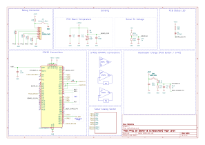

# Ping 1D Echo Sounder OSS (Open Source Sonar) Firmware

### Overview of the Ping 1D Echo Sounder

The [Ping Sonar Altimeter and Echosounder](https://bluerobotics.com/store/sonars/echosounders/ping-sonar-r2-rp/) (referred from now on as Ping 1D) is a low-cost and compact sonar altimeter and echosounder. According to the [Blue Robotics](https://bluerobotics.com/) website:

> The Ping sonar is a single-beam echosounder that measures distances up to 100 meters (328 feet) underwater. A 25-degree beam width, 300-meter (984-foot) depth rating, and an open-source software interface make it a powerful tool for marine robotics.

Some details about the sonar taken from the [product page](https://bluerobotics.com/store/sonars/echosounders/ping-sonar-r2-rp/) that will be used in this document:

| **Acoustic Specification**         | **Value**            |
|---------------------------|----------------------|
| **Frequency**             | 115 kHz             |
| **Source Level**          | 198 dB re 1 µPa @ 1 m |
| **Beamwidth (-3 dB from peak)** | 25 degrees     |
| **Typical Minimum Range** | 0.3 m / 1 ft        |
| **Typical Usable Range¹** | 100 m / 328 ft      |
| **Range Resolution**      | 0.5% of range       |
| **Range Resolution at 100 m** (waterfall range, not measured range) | 50 cm / 19.7 in |
| **Range Resolution at 2 m** (waterfall range, not measured range)  | 1 cm / 0.4 in   |


### Nature of the Open Source Firmware

While Blue Robotics supports open-source principles, including making open-source the visualization software, the Ping 1D firmware / hardware is not open source. This repository was created to provide an open-source version of the firmware for the Ping 1D sonar.

As for this firmware:
- It does not aim to replace the original firmware.
- It is fully compatible with the existing firmware but is not an official or endorsed version.
- It was developed as a starting point for those interested in understanding and enhancing the Ping 1D sonar.

The development was based on reverse engineering of the hardware without analyzing or replicating the original firmware, ensuring no violation of intellectual property rights. Although developed by a Blue Robotics developer, this firmware is **not** an official product of Blue Robotics, and the company is not liable for any issues arising from its use.

The main intention of this open-source firmware is:
- To provide a learning resource for understanding the Ping 1D sonar.
- To enable users to improve or add functionalities to the sonar.

While this document includes an overview of the hardware, it does not include complete hardware schematics, as they are proprietary and were reverse-engineered without access to the original documentation, making sure that no intellectual property rights were violated.

This firmware is provided "as is," without any warranties or guarantees of any kind. It, as well any other resources provided here, may contain errors or inaccuracies as it was developed without access to the original documentation.

## Hardware

### High level schematic



### Sonar Basics

The sonar's core processing unit is the [STM32F303RET6](https://www.st.com/resource/en/datasheet/stm32f303re.pdf) MCU (microcontroller) from STMicroelectronics. This MCU manages all key functionalities of the sonar, including:

- Generating the sonar pulse.
- Receiving the echo signal.
- Processing the received signal.

Communication between the MCU and the host computer occurs via a serial interface.

The sonar's basic operation revolves around two key pins:
- **PC6:** Used to generate the sonar pulse.
- **PB15:** Used to receive the echo signal.

The sonar pulse is generated by **Advanced Timer 8 (TIM8)** on **Channel 1** as a PWM (Pulse Width Modulation) output. The echo signal is captured through **ADC4 Channel 5**, which is a Fast Channel.

### Amplification and filtering (Analog Sector)

The amplification and filtering of the received signal are proprietary and have been kept closed-source to avoid any potential violation of the sonar's intellectual property rights. The only information that this document shares is that the received signal is filtered using a band-pass filter centered around the transmission frequency of **115 kHz**.

For the firmware, it is important to note that the analog sector shares some functionality with the internal operational amplifiers (OPAMPs) of the MCU. The following details are relevant:

- **OPAMPs 2 and 3:** Configured in PGA (Programmable Gain Amplifier) mode for gain control.
- **OPAMP 4:** Configured in standalone mode for bias (offset adjustment), working in conjunction with the internal DAC.

The pin configurations for these OPAMPs are available in the high-level schematic.

### Sensing

The sonar board is equipped with sensing capabilities that allow some measurements to be performed. The available sensing points include:

- **PCB Temperature Sensing:** Available on **PA2** (ADC1 Channel 3).
- **Supply Voltage (5V) Sensing:** Available on **PC2** (ADC1 Channel 8).
- **Internal Processor Temperature Sensing:** Accessible via the **ADC1 Temperature Sensor channel**.

### Bootloader

Entering the bootloader mode is essential for reflashing the sonar via the UART1 interface connected to the host computer. To enter bootloader mode, the **BOOT0** pin on the MCU must be pulled high, and the sonar must be reset.

This can be achieved in two ways:

1. **Manual Method:**
   - Press the boot button on the sonar.
   - Cut and restore power to the sonar while keeping the boot button pressed.
   - Release the boot button after power is restored.

2. **Automated Method:**
   - Set the **BOOT_CHARGE_PIN (PB7)** high.
   - Allow the independent watchdog timer to reset the sonar after a brief delay.

3. **Ping Viewer**
   - When using a firmware that supports the **Automated Method**, the [Ping Viewer](https://docs.bluerobotics.com/ping-viewer/) software can be used to flash a new firmware. Check more details on the [Firmware Update](https://docs.bluerobotics.com/ping-viewer/firmware-update/) documentation page.

These methods ensure the device transitions into bootloader mode, enabling firmware updates.

## Firmware

The firmware is developed using the STM32 CubeMX tool for initialization and configuration. The firmware is written in C and is compiled using CMake and the GNU Arm Embedded Toolchain.

For more information check the [Installation and Setup](#installation-and-setup) section.

### Peripherals

#### Timers

Timers are the core components used to synchronize readings and generate the sonar pulse. This firmware leverages the STM32's interconnect matrix to automate and synchronize the sampling process. Transmission, delay, and reception are all timer-based and interconnected, allowing the firmware to initiate the process and wait for results to be processed using DSP (Digital Signal Processing) algorithms.

The timers utilized are the advanced timers **TIM8** and **TIM1**, and the 32-bit basic timer **TIM2**.

---

##### TIM8 (Advanced)

> Responsible for generating the sonar pulse, initiating the chain of events leading to the echo reception.

**Configuration:**
- **Clock Source:** PLLCLK2 at 144 MHz, providing high precision for pulse generation.
- **Mode:** Configured in **one-pulse mode**, generating a specified number of pulses (determined by the repetition counter) and then stopping.
- **PWM Output:**
  - Channel: CH1
  - Mode: PWM Mode 2
  - Frequency: 115 kHz
  - Duty Cycle: 50%
- **Trigger Event Selection (TRGO):** Configured as **ENABLE**, allowing TIM8 to trigger **TIM2** in sync with the start of the pulse transmission.

---

##### TIM1 (Advanced)

> Controls the timing of each sample acquisition by triggering ADC4 to read the received echo signal.

**Configuration:**
- **Clock Source:** PLLCLK2 at 144 MHz, providing high precision.
- **Mode:** Configured in **one-pulse mode**, generating a fixed number of pulses (determined by the repetition counter) and then stopping, resulting in a fixed number of samples.
- **Trigger Event Selection 2 (TRGO2):** Configured as **Compare Pulse OC1**, used by ADC4 as the source trigger for conversions.

---

##### TIM2

> Acts as a delay generator between the pulse transmission and the start of the echo signal reception, used for the scan start delay.

**Configuration:**
- **Clock Source:** PLLCLK2 at 144 MHz, providing high precision.
- **Mode:** Configured in **one-pulse mode**, generating a delay based on the repetition counter and then stopping.
- **Trigger Event Selection (TRGO):** Configured as **Compare Pulse OC1**, triggering **TIM1** when the delay period ends.

---

#### ADCs

All ADCs use DMA (Direct Memory Access) for efficient data transfer. The configurations for the ADCs are detailed below:

##### ADC1

> ADC1 handles the sensing channels for the sonar system. It operates in continuous mode with 12 bits precision and is configured as follows:

**Configuration:**
- **Clock Source:** The ADC clock is prescaled to **1/12 of the PLL clock**, resulting in a **6 MHz clock** fed to the ADC.
- **Interrupts and DMA:**
  - Both the ADC interrupt and its associated DMA interrupt are disabled (We don't care since we read when we want).
  - The DMA is configured as a **half-word-to-half-word transfer** in circular mode with low priority.
- **Channel Scanning:**
  - The ADC is set to **scan mode** to read multiple channels in sequence.
  - It is **software-triggered** and, once started, continuously reads channels in a loop, storing the results in a dedicated buffer within the firmware's Board module.

**Configured Channels:**
1. **Supply Voltage (5V) Sensing:**
   - **Pin:** PC2
   - **Channel:** ADC1 Channel 8
   - **Rank:** 1
   - **Sampling Time:** 601.5 cycles

2. **PCB Temperature Sensing:**
   - **Pin:** PA2
   - **Channel:** ADC1 Channel 3
   - **Rank:** 2
   - **Sampling Time:** 601.5 cycles

3. **Internal Processor Temperature Sensing:**
   - **Channel:** ADC1 Temperature Sensor channel
   - **Rank:** 3
   - **Sampling Time:** 601.5 cycles

---

##### ADC4

> This one is the main ADC used to receive echo signals from the sonar. It operates in a slave mode with 8 bit precision for fast readings triggered by **TIM1** and is configured as follows:

- **Clock Source:** The ADC clock is fed with PLL clock resulting in a **72 MHz clock**.
- **Interrupts and DMA:**
  - The ADC interrupt is disabled. DMA Interrupt is enabled but its not so important only used as fallback.
  - The DMA is configured as a **half-word-to-byte transfer** in normal mode with low priority.
- **Channel Scanning:**
  - No channel scanning is used. The ADC is configured to read only one channel.
  - It is triggered by **TIM1** and reads the echo signal from the sonar aat fixed intervals by N repetitions set in **TIM1** repetition counter.

**Configured Channels:**
1. **Echo Return Signal:**
   - **Pin:** PB15
   - **Channel:** ADC4 Channel 5
   - **Rank:** 1
   - **Sampling Time:** Dynamically adjusted by firmware, ranging from 7.5 to 61.5 cycles.

---

##### OPAMPs

The operational amplifiers (OPAMPs) have some common configurations:
  - User trimming is enabled.
  - Self-calibration is enabled.

---

- **OPAMP2 and OPAMP3:**
  - Configured in **PGA (Programmable Gain Amplifier)** mode (not connected mode).
  - Default gain is set to a maximum of **16**, but this is dynamically adjusted to optimize signal quality.
  - As these OPAMPs are connected to the external analog sector, all associated pins are set to **analog mode**.

---

- **OPAMP4:**
  - Configured in **standalone mode**.
  - All associated pins are set to **analog mode**.
  - Works in conjunction with the internal **DAC** to adjust the bias (offset) of the received signal since PGA OPAMPs introduces a lot of offset.

##### DAC

> The internal DAC is used to adjust the bias (offset) of the received signal. Ideally the received signal should be centered around the mid range of the ADC, but due to mainly the **PGA** offsets introduced when changing the gain, the signal is not centered. The DAC is used to adjust this offset.

Configuration:
- **OUT1 (PA4)** is configured to be used, it is connected to the **OPAMP4**.
- **Output buffer**: disabled.
- **Trigger Source:** None.

### Firmware overview

The sonar usually operates in a cycle that consists of the following steps:
  - **Transmitting a pulse:** The sonar generates a pulse using **TIM8** and sends it to the water.
  - **Delay:** The sonar waits for a delay **TIM2** before starting to receive the echo signal if specified.
  - **Receiving the echo signal:** The sonar receives the echo signal using **TIM1** and **ADC4**.
  - **Processing the echo signal:** The sonar processes the echo signal using the DSP module.
  - **Sending the data:** The sonar sends the processed data to the host computer.

As this firmware uses a separated buffer for UART communication, the sonar can be commanded to send the data at any time, not only after a full cycle. And the same time it finished a Processing cycle, it can start another one without needing to wait for the data to be sent.

Code is organized as follows:

1. **Sonar Module**

> The Sonar Module is responsible for the core functionality of the echo sounder. It manages the entire echo capture sequence—generating transmit pulses, handling echo reception, running digital signal processing (DSP), and providing real-time updates. It centers around the **PingSonar** class in sonar.cpp.

2. **Board Module**

> The Board Module is responsible mainly to manage the sensing part of the sonar, reading the supply voltage, PCB temperature, and internal processor temperature. It also have some utilities that lies around the way the sonar PCB is made, it being mainly the **go to bootloader** logic.

3. **Server Module**

> The Server Module is responsible for handling the communication between the sonar and the host computer. It manages the serial communication, including receiving commands and sending data back to the host. It centers around the **PingServer** class in server.cpp.

4. **DSP Module**

> The DSP Module is responsible for processing the echo signal received by the sonar. Not like other modules it consists of a series of optimized functions that are used by the **PingSonar** class to process the echo signal. It is by default stored in the CCM (Core Coupled Memory) of the MCU to ensure that it can be executed at the highest speed possible.

### Communication

The sonar operates using the **Ping Protocol**. It enables structured message exchanges between the sonar and external systems.

- **Ping Protocol Documentation:** [Ping Protocol](https://docs.bluerobotics.com/ping-protocol/)
- **Ping1D Message Format:** [Ping1D Messages](https://docs.bluerobotics.com/ping-protocol/pingmessage-ping1d/)

For implementation, the sonar utilizes **ping-cpp**, a C++ library that provides a structured interface for communicating with devices following the Ping Protocol. This library facilitates message parsing, serialization, and device interaction.

- **Ping-CPP Library:** [GitHub - ping-cpp](https://github.com/bluerobotics/ping-cpp)

## Installation and Setup

The sonar firmware is developed using **STM32CubeMX** for peripheral configuration and can be imported into **STM32CubeIDE** if needed. However, the primary build system is **CMake**, which provides flexibility and ensures compatibility with various development environments.

### Prerequisites

Before building the firmware, ensure that the necessary dependencies are installed:

1. **Arm GNU Toolchain**
   The firmware is compiled using `arm-none-eabi-gcc`. You can check how to install it from [Arm Developer](https://developer.arm.com/Tools%20and%20Software/GNU%20Toolchain).

2. **Boost CMake**
   Boost libraries are required for building **ping-cpp** submodule. You can install it using your package manager or download it from the [Boost website](https://www.boost.org/).

### Building the Firmware

The firmware is compiled using **CMake**. Follow these steps to build it:

```sh
git submodule update --init --recursive
cd firmware
cmake -B build
cmake --build build --config Release --parallel
```

This process generates the firmware binary, which can be flashed to the STM32 microcontroller using the UART interface with the device in bootloader mode. Or you can use the [Ping Viewer](https://docs.bluerobotics.com/ping-viewer/) software to flash the firmware.
For more details refer to the [Bootloader](#bootloader) section.

If using the UART interface, you can use the **stm32flash** tool to flash the firmware. For example:

```sh
stm32flash -v -g 0x0 -b 115200 -w build/Release/ping-firmware-oss.hex <your device port>
```

It's also possible to flash the firmware via CMake to put the device in **bootloader mode**:

```sh
cmake -B build -DFLASH_DEVICE=/dev/ttyUSB0 && cmake --build build --config Release --parallel --target flash
```

Make sure to have the device in bootloader mode before flashing the firmware and that `<your device port>` is changed to the correct port for the device, by example in a linux environment it could be `/dev/ttyUSB0`.

### Configuration

The sonar operational aspects can be configured using the **config.h** file. This file contains various parameters that can be adjusted to customize the sonar's behavior based on specific requirements. All parameters are documented in the file, making it easy to understand and modify the configuration.
